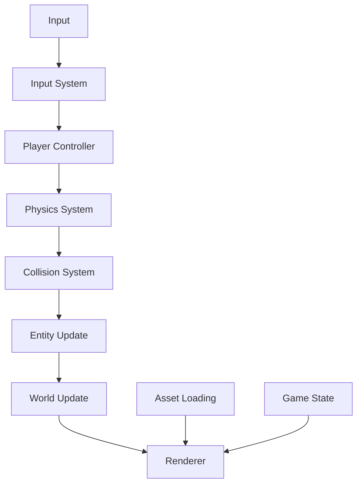
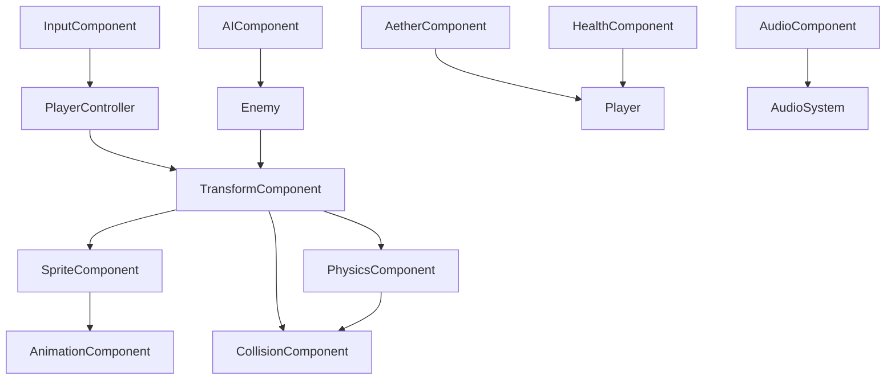

# Adventure Jumper - System Architecture

**Status:** Active  
**Created:** January 2025  
**Last Updated:** January 2025  
**Related Documents:**
- [Design Cohesion Guide](../04_Project_Management/DesignCohesionGuide.md)
- [Agile Sprint Plan](../04_Project_Management/AgileSprintPlan.md)
- [Technical Design Documents](TDD/README.md)
- [Components Reference](ComponentsReference.md)

## Overview
*Building Systems That Serve the Vision*

Adventure Jumper's architecture is designed around the core philosophy of **fluid, expressive gameplay** that makes players feel increasingly powerful and connected to the world. Every system decision is evaluated against our Design Pillars: Fluid & Expressive Movement, Engaging & Dynamic Combat, and Progressive Mastery.

> **Design Cohesion Integration**: This architecture directly implements the technical foundation needed to support Kael's journey of mastering Jumper abilities while uncovering the truth about the Great Fracture. Each system component is designed to enhance the player's sense of growing power and world connection.

## Design Pillars Integration

### Fluid & Expressive Movement Architecture
Our component-system architecture prioritizes:
- **Responsive Input**: Direct input-to-action mapping with minimal frame delay
- **Composable Abilities**: Movement abilities that build naturally on each other
- **Physics Consistency**: Predictable physics that enable skillful play
- **State Preservation**: Smooth transitions between movement states

### Engaging & Dynamic Combat Integration  
Combat systems are built to:
- **Integrate with Movement**: Combat abilities enhance rather than interrupt movement flow
- **Support Creativity**: Multiple valid approaches to encounters
- **Provide Clear Feedback**: Immediate visual and audio confirmation of actions
- **Scale with Skill**: Depth that rewards player mastery

### Progressive Mastery Support
The architecture enables:
- **Ability Evolution**: Systems that grow more complex as abilities unlock
- **Contextual Complexity**: Advanced features emerge naturally from basic interactions
- **Player Expression**: Technical framework for diverse play styles
- **Consistent Growth**: Each new ability feels like a natural extension

# Adventure Jumper - Architecture Overview

## High-Level Architecture

Adventure Jumper is built using the Flame game engine on top of Flutter, following a hybrid architecture that combines Entity-Component-System (ECS) patterns with traditional game object hierarchies.

> **Technical Design Documents:**
> - [Player Character](TDD/PlayerCharacter.TDD.md) - Main character implementation
> - [Aether System](TDD/AetherSystem.TDD.md) - Energy mechanics
> - [Audio System](TDD/AudioSystem.TDD.md) - Sound implementation
> - [Full TDD List](TDD/) - All technical design documents

## Core Systems

### 1. Game Engine (Flame)
- **Game Class**: Main game container that manages the game loop
- **World**: Handles the game world and its entities
- **Camera**: Manages viewport and following the player
- **Input Handling**: Processes user input for game controls

### 2. Entity-Component-System
- **Entities**: Game objects (Player, Enemies, Items, etc.)
- **Components**: Reusable behaviors and properties (e.g., Position, Physics, Render)
- **Systems**: Logic that processes components (e.g., MovementSystem, CollisionSystem)

### 3. Game State Management
- **Game State**: Tracks current game state (Menu, Playing, Paused, Game Over)
- **Save System**: Handles game progress persistence
- **Settings**: Manages game settings and preferences

## Sprint 1: Foundation Architecture (65+ Class Scaffolding)

### Design Cohesion Implementation
Sprint 1 establishes the architectural foundation that directly supports our Design Pillars:

**Fluid & Expressive Movement Foundation:**
- Component-based player controller enabling smooth state transitions
- Physics system optimized for responsive input handling
- Movement ability framework that supports composable abilities

**Engaging & Dynamic Combat Integration:**
- Combat system architecture that integrates seamlessly with movement
- Flexible damage calculation system supporting diverse encounter approaches
- Visual feedback coordination between combat and movement systems

**Progressive Mastery Technical Support:**
- Modular ability system allowing for natural complexity growth
- Upgrade framework enabling player skill expression
- Consistent interfaces for expanding player capabilities

### Sprint 1 Module Structure (11 Core Modules)

#### 1. Game Module (`/lib/game/`) - 4 Classes
**Primary Classes:**
- `AdventureJumperGame` - Main game class extending FlameGame, coordinates all systems
- `GameWorld` - World container for all game entities, manages scene graph
- `GameCamera` - Camera controller with follow, smoothing, and cinematic effects
- `GameConfig` - Configuration constants, performance settings, and gameplay tuning

#### 2. Player Module (`/lib/player/`) - 5 Classes
**Design Cohesion Focus: Fluid & Expressive Movement**
- `Player` - Main player entity with responsive movement and progressive abilities
- `PlayerController` - Input handling optimized for immediate response and skill expression
- `PlayerAnimator` - Animation state management that enhances movement feel
- `PlayerStats` - Health, energy, and progression data supporting mastery growth
- `PlayerInventory` - Item management enabling creative problem-solving approaches

#### 3. Entities Module (`/lib/entities/`) - 6 Classes  
**Design Cohesion Focus: Dynamic Combat & World Interaction**
- `Entity` - Base class for all game entities with consistent interaction patterns
- `Enemy` - Base enemy class encouraging creative combat approaches
- `NPC` - Non-player character base class supporting narrative depth
- `Collectible` - Items and pickups that enhance player capabilities
- `Platform` - Environmental platform objects enabling movement creativity
- `Hazard` - Environmental dangers that integrate with combat and movement

#### 4. Components Module (`/lib/components/`) - 10 Classes
**Design Cohesion Focus: System Integration & Composability**
- `TransformComponent` - Position, rotation, scale with smooth interpolation
- `SpriteComponent` - Visual representation supporting world theming
- `PhysicsComponent` - Physics properties optimized for responsive controls
- `AnimationComponent` - Sprite animation control with fluid transitions
- `AetherComponent` - Energy and ability management enabling progressive mastery
- `HealthComponent` - Health and damage tracking with clear feedback
- `InputComponent` - Input processing with buffering for responsive feel
- `AIComponent` - Artificial intelligence behaviors supporting dynamic encounters
- `CollisionComponent` - Collision detection enabling precise player control
- `AudioComponent` - Sound effect management enhancing feedback clarity

#### 5. Systems Module (`/lib/systems/`) - 9 Classes
**Design Cohesion Focus: Seamless Integration & Performance**
- `MovementSystem` - Entity movement processing prioritizing responsiveness
- `PhysicsSystem` - Physics simulation optimized for gameplay feel over realism
- `AnimationSystem` - Animation state updates supporting visual feedback
- `InputSystem` - Input event processing with prediction and buffering
- `AISystem` - Enemy AI behavior processing enabling dynamic encounters
- `CombatSystem` - Attack and damage calculations integrated with movement
- `AetherSystem` - Energy and ability processing supporting progressive unlocks
- `AudioSystem` - Sound management providing clear action feedback
- `RenderSystem` - Visual rendering coordination supporting world theming

#### 6. World Module (`/lib/world/`) - 6 Classes
**Design Cohesion Focus: Seamless Progression & Exploration**
- `Level` - Individual level container supporting exploration and discovery
- `LevelLoader` - Level data loading with smooth transitions
- `LevelManager` - Level progression supporting player mastery demonstration
- `Biome` - Biome-specific logic enhancing world distinctiveness
- `Checkpoint` - Save point functionality providing clear progress markers
- `Portal` - Level transition mechanics maintaining world connectivity

#### 7. UI Module (`/lib/ui/`) - 6 Classes
**Design Cohesion Focus: Clear Communication & World Integration**
- `GameHUD` - In-game heads-up display providing clear ability and status feedback
- `MainMenu` - Main menu interface reflecting world aesthetics
- `PauseMenu` - Pause screen functionality maintaining immersion
- `InventoryUI` - Inventory management interface supporting strategic planning
- `SettingsMenu` - Game settings configuration with accessibility options
- `DialogueUI` - Story dialogue display enhancing narrative immersion

#### 8. Audio Module (`/lib/audio/`) - 5 Classes
**Design Cohesion Focus: Immersive Feedback & World Building**
- `AudioManager` - Central audio control supporting dynamic mixing
- `SoundEffect` - Individual sound effect wrapper with spatial positioning
- `MusicTrack` - Background music management with seamless transitions
- `AudioCache` - Audio asset caching optimized for smooth playback
- `SpatialAudio` - Positional audio effects enhancing world immersion

#### 9. Assets Module (`/lib/assets/`) - 5 Classes
**Design Cohesion Focus: Efficient Content Delivery**
- `AssetManager` - Central asset loading and caching with priority systems
- `SpriteLoader` - Sprite and texture management supporting world theming
- `AnimationLoader` - Animation data loading optimized for smooth playback
- `LevelDataLoader` - Level file parsing with validation and error handling
- `AudioLoader` - Audio file management with format optimization

#### 10. Save Module (`/lib/save/`) - 4 Classes
**Design Cohesion Focus: Progress Preservation & Player Investment**
- `SaveManager` - Save/load coordination with integrity checking
- `SaveData` - Serializable game state preserving player progress
- `ProgressTracker` - Achievement and mastery milestone tracking
- `Settings` - User preferences persistence supporting accessibility

#### 11. Utils Module (`/lib/utils/`) - 5 Classes
**Design Cohesion Focus: Performance & Development Support**
- `MathUtils` - Mathematical helper functions optimized for gameplay calculations
- `CollisionUtils` - Collision detection helpers supporting precise interactions
- `AnimationUtils` - Animation timing and interpolation for smooth feedback
- `FileUtils` - File I/O operations with robust error handling
- `DebugUtils` - Development and debugging tools for maintaining quality

### Design Cohesion Validation Metrics

Each module includes validation checkpoints against our Design Pillars:

**Fluid & Expressive Movement Validation:**
- Input lag < 2 frames for all player actions
- Smooth transitions between all movement states
- Consistent physics behavior across all platforms
- No movement interruptions during ability use

**Engaging & Dynamic Combat Validation:**
- Combat integrates seamlessly with movement abilities
- Multiple valid approaches to every encounter
- Clear audio/visual feedback for all combat actions
- Damage calculations feel fair and understandable

**Progressive Mastery Validation:**
- New abilities build naturally on existing mechanics
- Player skill expression increases with progression
- Advanced techniques emerge from basic interactions
- Consistent complexity growth across all systems

## Data Flow



## Core Components

The game uses a component-based architecture with the following core components:

### Primary Components
- **TransformComponent**: Position, rotation, and scale with world/local coordinates
- **SpriteComponent**: Visual representation using sprites with layer management
- **PhysicsComponent**: Physics properties including velocity, acceleration, and collision boxes
- **AnimationComponent**: Handles sprite animations with state transitions and timing
- **AetherComponent**: Manages Aether energy for abilities with regeneration rates
- **HealthComponent**: Tracks health and damage with invincibility frames
- **InputComponent**: Processes input for controllable entities with action mapping
- **AIComponent**: Artificial intelligence behaviors with state machines
- **CollisionComponent**: Collision detection and response with layer filtering
- **AudioComponent**: Sound effect management with 3D positioning

### Component Dependencies


### Component Interaction Patterns
- **Transform** serves as the base for all spatial components
- **Physics** and **Collision** work together for movement and interaction
- **Sprite** and **Animation** handle all visual representation
- **Input** feeds into controller logic for player entities
- **AI** drives autonomous entity behaviors
- **Aether** and **Health** manage character states and abilities

See [Components Reference](ComponentsReference.md) for a complete list of components and their properties.

## Subsystems Detail

### Level Management
**Key Classes:** `Level`, `LevelLoader`, `LevelManager`, `Biome`, `Checkpoint`, `Portal`
- Level loading and unloading with asset management
- Seamless transition between levels and biomes
- Checkpoint system with save state integration
- Portal mechanics for level progression
- Biome-specific environmental behaviors
- See [Level Format](LevelFormat.md) and [Level Management TDD](TDD/LevelManagement.TDD.md)

### Player System
**Key Classes:** `Player`, `PlayerController`, `PlayerAnimator`, `PlayerStats`, `PlayerInventory`
- Fluid character movement with momentum and precision controls
- Multi-state animation system (idle, running, jumping, attacking, etc.)
- Ability system with Aether energy integration
- Inventory management with equipment effects
- Character progression and stat tracking
- See [Player Character TDD](TDD/PlayerCharacter.TDD.md)

### Combat System
**Key Classes:** `CombatSystem`, `Enemy`, `AIComponent`, `HealthComponent`
- Attack mechanics with timing-based combat
- Damage calculation with elemental affinities
- Enemy AI behaviors with state machines
- Projectile and area-of-effect attacks
- Status effects and temporary modifications
- See [Combat System TDD](TDD/CombatSystem.TDD.md) 

### Aether System
**Key Classes:** `AetherSystem`, `AetherComponent`, `AetherAbility`, `AetherNode`
- Energy mechanics with regeneration and consumption
- Special ability activation with cooldowns
- Environmental interaction through Aether manipulation
- Aether node discovery and network connections
- Progression-gated ability unlocks
- See [Aether System TDD](TDD/AetherSystem.TDD.md)

### Save System
**Key Classes:** `SaveManager`, `SaveData`, `ProgressTracker`, `Settings`
- Comprehensive progress persistence including level completion
- Game state serialization with version compatibility
- Achievement and milestone tracking
- User preference management
- Cloud save integration capability
- See [Save Game Format](SaveGameFormat.md) and [Save System TDD](TDD/SaveSystem.TDD.md)

### Audio System
**Key Classes:** `AudioManager`, `SoundEffect`, `MusicTrack`, `SpatialAudio`
- Dynamic music system with biome-specific tracks
- Spatial audio for immersive environmental effects
- Sound effect layering and mixing
- Audio caching and memory management
- Accessibility features (visual sound indicators)
- See [Audio System TDD](TDD/AudioSystem.TDD.md)

### UI System
**Key Classes:** `GameHUD`, `MainMenu`, `PauseMenu`, `InventoryUI`, `DialogueUI`
- Responsive UI scaling across different screen sizes
- Animated interface elements with smooth transitions
- Accessibility compliance with screen reader support
- Customizable control schemes and key binding
- Contextual help and tutorial integration

## Sprint 1 Scaffolding Specifications

### Directory Structure for Initial Setup
```
lib/
├── game/
│   ├── adventure_jumper_game.dart
│   ├── game_world.dart
│   ├── game_camera.dart
│   └── game_config.dart
├── player/
│   ├── player.dart
│   ├── player_controller.dart
│   ├── player_animator.dart
│   ├── player_stats.dart
│   └── player_inventory.dart
├── entities/
│   ├── entity.dart
│   ├── enemy.dart
│   ├── npc.dart
│   ├── collectible.dart
│   ├── platform.dart
│   └── hazard.dart
├── components/
│   ├── transform_component.dart
│   ├── sprite_component.dart
│   ├── physics_component.dart
│   ├── animation_component.dart
│   ├── aether_component.dart
│   ├── health_component.dart
│   ├── input_component.dart
│   ├── ai_component.dart
│   ├── collision_component.dart
│   └── audio_component.dart
├── systems/
│   ├── movement_system.dart
│   ├── physics_system.dart
│   ├── animation_system.dart
│   ├── input_system.dart
│   ├── ai_system.dart
│   ├── combat_system.dart
│   ├── aether_system.dart
│   ├── audio_system.dart
│   └── render_system.dart
├── world/
│   ├── level.dart
│   ├── level_loader.dart
│   ├── level_manager.dart
│   ├── biome.dart
│   ├── checkpoint.dart
│   └── portal.dart
├── ui/
│   ├── game_hud.dart
│   ├── main_menu.dart
│   ├── pause_menu.dart
│   ├── inventory_ui.dart
│   ├── settings_menu.dart
│   └── dialogue_ui.dart
├── audio/
│   ├── audio_manager.dart
│   ├── sound_effect.dart
│   ├── music_track.dart
│   ├── audio_cache.dart
│   └── spatial_audio.dart
├── assets/
│   ├── asset_manager.dart
│   ├── sprite_loader.dart
│   ├── animation_loader.dart
│   ├── level_data_loader.dart
│   └── audio_loader.dart
├── save/
│   ├── save_manager.dart
│   ├── save_data.dart
│   ├── progress_tracker.dart
│   └── settings.dart
└── utils/
    ├── math_utils.dart
    ├── collision_utils.dart
    ├── animation_utils.dart
    ├── file_utils.dart
    └── debug_utils.dart
```

### Minimum Viable Class Definitions for Sprint 1

Each scaffolded class should include:
1. **Class declaration** with appropriate inheritance/mixins
2. **Constructor** with basic parameter validation
3. **Essential properties** as placeholders
4. **Core method signatures** without full implementation
5. **TODO comments** indicating Sprint 2+ implementation areas
6. **Documentation comments** explaining class purpose

Example class template:
```dart
/// [Description of class purpose and responsibilities]
/// 
/// Planned features for future sprints:
/// - [Feature 1]
/// - [Feature 2]
class ExampleClass extends BaseClass with RequiredMixin {
  // Essential properties
  final String id;
  bool _isInitialized = false;
  
  /// Constructor with validation
  ExampleClass({required this.id}) {
    assert(id.isNotEmpty, 'ID cannot be empty');
  }
  
  /// Core method signatures
  Future<void> initialize() async {
    // TODO: Implement in Sprint 2
    _isInitialized = true;
  }
  
  void update(double dt) {
    // TODO: Implement core update logic in Sprint 2
  }
  
  void dispose() {
    // TODO: Implement cleanup in Sprint 2
    _isInitialized = false;
  }
}
```

### Integration Points for Sprint 1

**Critical Integration Requirements:**
1. All classes must compile without errors
2. Main game loop should instantiate core systems
3. Player entity should respond to basic input
4. Basic level should load with placeholder assets
5. Debug logging should be functional throughout

### Validation Criteria:**
- [ ] All 60+ classes compile successfully
- [ ] Main game runs without crashes
- [ ] Player character displays on screen
- [ ] Basic movement responds to keyboard input
- [ ] Level loads with placeholder background
- [ ] Debug console shows system initialization logs

### Sprint 1 File Count Summary
**Expected Scaffolded Files:** ~65 core class files across 11 modules
- **Game Module:** 4 files
- **Player Module:** 5 files  
- **Entities Module:** 6 files
- **Components Module:** 10 files
- **Systems Module:** 9 files
- **World Module:** 6 files
- **UI Module:** 6 files
- **Audio Module:** 5 files
- **Assets Module:** 5 files
- **Save Module:** 4 files
- **Utils Module:** 5 files

**Total Directory Structure:** 11 primary modules + subdirectories as needed

This comprehensive scaffolding ensures that the "walking skeleton" architecture is fully established, allowing all subsequent sprint work to build upon a solid, well-organized foundation that supports the game's modular design and component-based architecture.

## Development Guidelines

- Follow Flutter/Dart code style guidelines
- Use dependency injection for system coupling
- Implement unit tests for critical systems
- Document all public APIs and components

For more detailed implementation guidance, see the [Implementation Guide](../03_Development_Process/ImplementationGuide.md).
